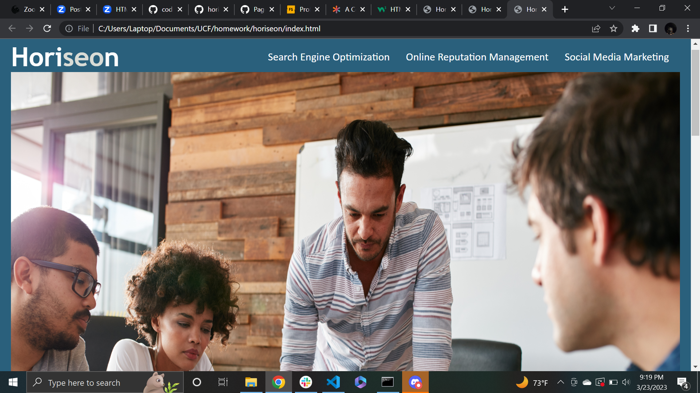

# horiseon

## This is the first challenge in my boot camp
-I was provided code for the Horiseon website and tasked to refactor the .html and update the .css
-I removed <div tags throughout and replaced them with <section, <header, and <footer
-Made adjustments to the .css to replace elements linked to <div that are no longer in the .html
-Cleaned the .css file to condense redundant elements into compound lines of code
-Learned to work with other coder's work, and the importance of condensing .css lines for legibility.

## Installation
-None, its a website

##
'''md

'''
link: https://adamabulkheir.github.io/horiseon/

## Credits
-received material from UCF Coding Bootcamp
-assisted by my peers

## License
-
